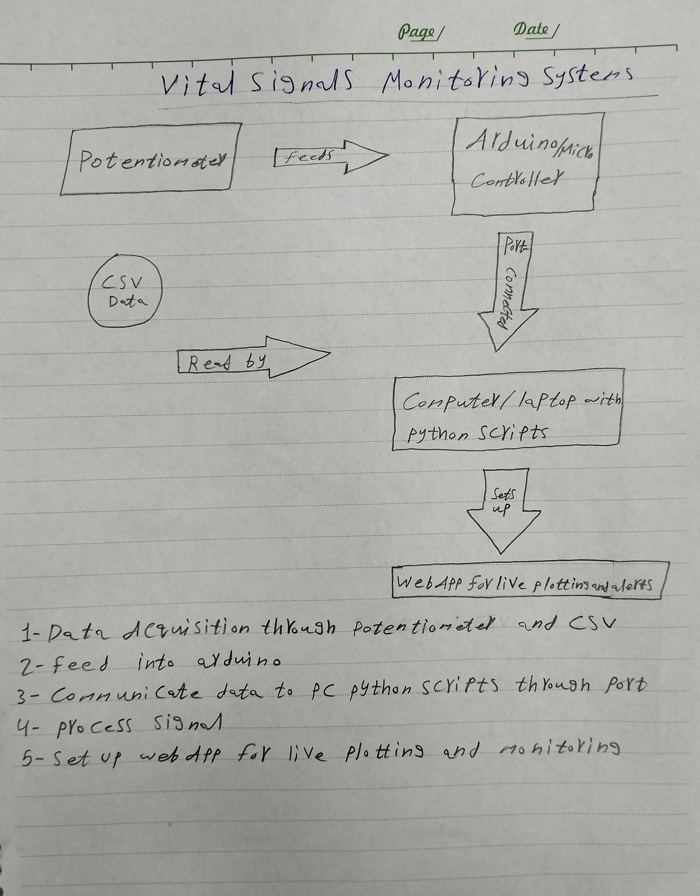
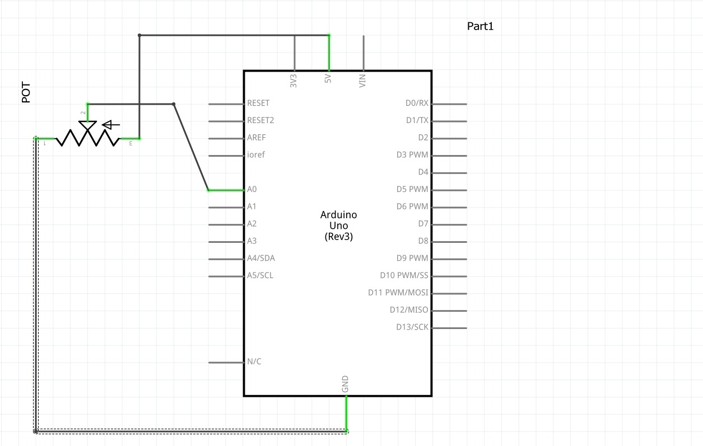
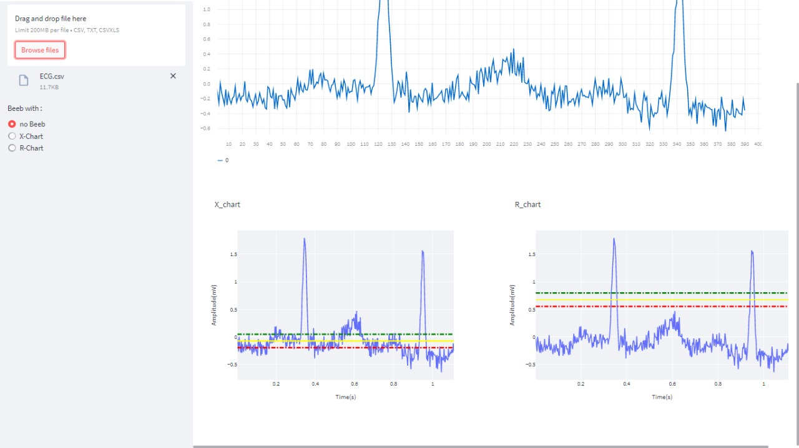

# Multi-Signal Monitoring System

- [Multi-Signal-Monitoring-System](#multi-signal-monitoring-system)
  - [Task-Info.](#task-info)
  - [Features](#features)
  - [Demos](#demos)
    - [Monitoring vital signals](#monitoring-vital-signals)
    - [Diagrams](#diagrams)
    - [Ploting signal on 𝑋̅-chart](#ploting-signal-on-x-chart)
  - [Run-App](#run-app)
## Task-Info. 
- This course is about _Midical Instrumentations_ for Third-year of Department of Medical Engineering, first semester on **14th Nov.2022**
- Members who participated in the work of this project:
  | Names           | Section | Bench Number |
  | --------------- | ------- | ------------ |
  | Adham Mohammed  |    1    |      9       |
  | Abdelrahman Ali |    1    |     55       |
  | Amr Kamal       |    2    |     6        |
  | Amr Mohammed    |    2    |     7        |
  | Mohammed Sayed  |    2    |     18       |
  | Mina Azer       |    2    |     45       |
  

## Features
- Monitoring vital signals in real-time
- block diagrams that shows system components and means of communication.
- Ploting signal on 𝑋̅-chart. This chart is responsible for monitoring measurements mean and determine whether a sample is in-control or out-of-control and fire the proper alarm after detecting any out-of-control signal.

## Demos

### Monitoring vital signals 


### Diagrams 
 | 

### Ploting signal on 𝑋̅-chart


## Run-App
**_Run the application_**
```sh
streamlit ru MI.py

